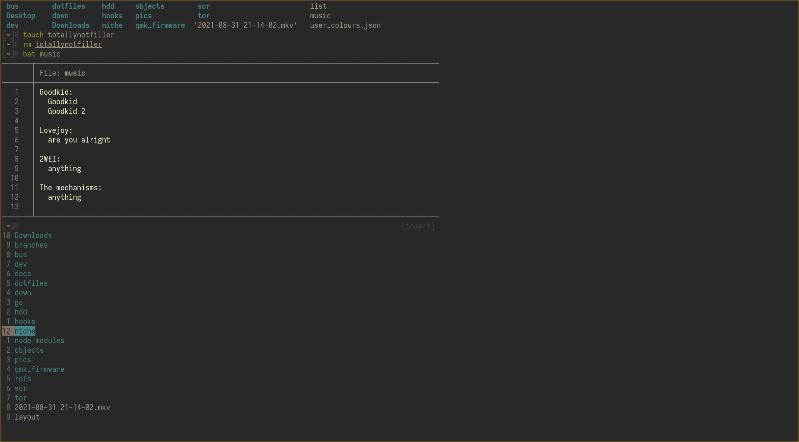
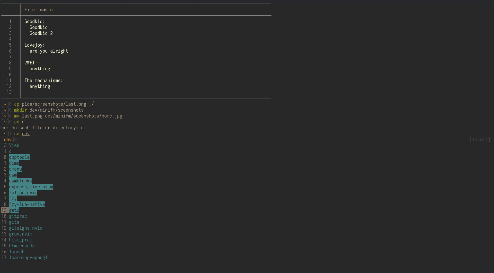
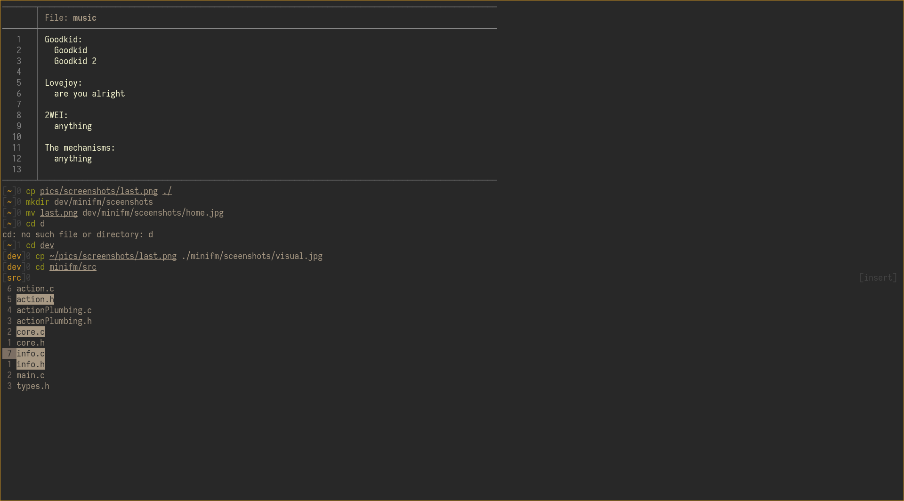

# Minifm
## About
Minifm ie MiniFileManager is a visual file manager inspired by program such as Ranger, Vifm, NNN, etc; as well as fzf, and fzy in the way they use term codes instead of ncurses to avoid making the program a full screen process.

**WARNING**: this program is in it's early stages use at your own risk, and if it doesn't work for you be sure to let me know, I'd really like to have it running well on other machines.
**REWRITE**: the code for the project isn't maintainable, so I'm working on some better foundations that'll show up elsewhere on my github, before they're implemented here

## Usage
this program is ment to preform small action on files in the current directory, such as changing directory, opening a file, deleting, copying.

As far as I know changing the current directory of your shell has to be done by said shell, and not a child process. In-order to do this I use a shell function like so:

```bash
function mfm()
{
  mfm_path="$1"
  mfm_backup_path=""
  while [ -n "$mfm_path" ]; do
    mfm_path=`minifm $mfm_path </dev/tty`
    [ -f "$mfm_path" ] && $EDITOR $mfm_path
    [ -d "$mfm_path" ] && cd $mfm_path
    [ -n "$mfm_path" ] && mfm_path="$PWD"
  done
}
```

Since Minifm simply outputs the file path of a file, when pressing enter, this can make scripting fairly easy.

All of the other features in mfm are done outside of the current shell, and thus don't need a function.

## Installation
```bash
sudo make install
```

## Screenshots

Home directory:


Visual mode:


Single selections:



# Todo
* [x] Perform basic file operations
* [ ] Git integration \**some status*
* [ ] Mass rename functionality
* [x] Script friendly
* [ ] Preview
* [ ] Custom themes \**much easier to change*

